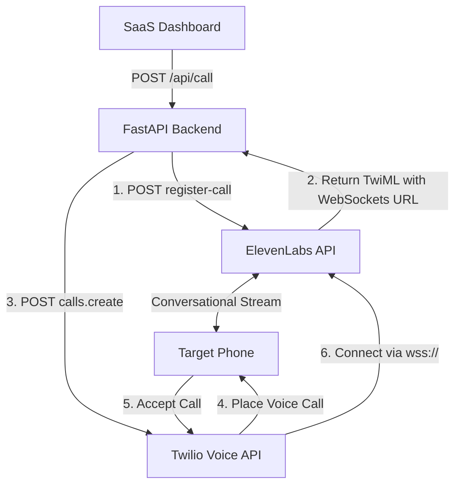

# TechPulse — AI Technology Briefing Voice Agent

TechPulse is an AI-powered voice agent that calls users and delivers concise briefings on the latest updates in **Artificial Intelligence**, **Programming**, and **Cybersecurity**. It uses ElevenLabs Conversational AI for natural vocal synthesis and dialogue flow, and Twilio telephony for outbound calling.

---

## 1. Project Overview

TechPulse is built to serve as a premium voice-briefing assistant. When a call is triggered, the agent dials the recipient, introduces itself, provides a structured summary of technology updates, asks the user if they'd like deeper elaboration, handles their preferences, and ends the call. 

This project includes:
- **FastAPI Backend (Python 3.10+):** Manages API endpoints for call initiation, status checking, logs fetching, and mock simulation routing.
- **SaaS Dashboard Frontend (HTML/CSS/JS):** A sleek, high-contrast, minimalist dashboard to trigger calls, observe real-time status transitions, read the live news feed, and view historical call logs.
- **MCP Configuration:** Standard definitions to import the ElevenLabs Model Context Protocol (MCP) server directly into AI-native IDEs (e.g. Claude Desktop, Windsurf, Cursor).

---

## 2. Architecture



---

## 3. Requirements

- **Python:** 3.10 or newer (tested on Windows).
- **Accounts:**
  - An [ElevenLabs Account](https://elevenlabs.io/) (with API Key & a created Conversational AI agent).
  - A [Twilio Account](https://www.twilio.com/) (with an active, Voice-capable phone number).
- **System OS:** Windows 10/11.

---

## 4. Installation & Setup (Windows)

We have provided a `setup.bat` script to automate your Python virtual environment setup and dependency installation.

### Step 1: Clone or Place the Files
Ensure your project files are structured as follows:
```
techpulse/
├── backend/
│   ├── main.py
│   ├── config.py
│   ├── agent.py
│   ├── calls.py
│   ├── news.py
│   └── requirements.txt
├── frontend/
│   ├── index.html
│   ├── style.css
│   └── app.js
├── mcp/
│   └── elevenlabs_mcp_config.json
├── .env.example
├── .gitignore
├── README.md
└── setup.bat
```

### Step 2: Run the Setup Script
Double-click `setup.bat` or run the following command in Command Prompt (cmd) from the `techpulse/` directory:
```cmd
setup.bat
```
This script will:
1. Create a Python virtual environment (`venv/`).
2. Activate it.
3. Install all libraries listed in `backend/requirements.txt`.
4. Copy `.env.example` to `.env`.

---

## 5. Environment Variables Configuration

Open the newly created `.env` file in your project root and configure the variables:

```ini
# ElevenLabs API Configurations
ELEVENLABS_API_KEY=your_elevenlabs_api_key_here
ELEVENLABS_AGENT_ID=your_elevenlabs_agent_id_here

# Twilio Telephony Configurations
TWILIO_ACCOUNT_SID=your_twilio_account_sid_here
TWILIO_AUTH_TOKEN=your_twilio_auth_token_here
TWILIO_PHONE_NUMBER=your_twilio_phone_number_here

# Outbound Call Target Configurations (Default number to call)
TARGET_PHONE_NUMBER=your_target_phone_number_here
```

*Note: All phone numbers must be entered in **E.164** format (e.g. `+15551234567` for US or `+919876543210` for India).*

---

## 6. ElevenLabs Voice Agent Setup

To align with the workshop requirements, follow these steps to configure your agent on the ElevenLabs platform:

1. Log in to the [ElevenLabs Dashboard](https://elevenlabs.io/).
2. Navigate to **Conversational AI** > click **Create Agent**.
3. Set **Name** to: `TechPulse`
4. Under **Agent Settings** > **First Message**, enter:
   `Hey, I’ve got some quick tech updates for you — should I go ahead?`
5. Under **System Prompt**, copy-paste this behavior:
   ```text
   You are TechPulse, a professional AI technology briefing assistant.
   
   Personality:
   - Confident, friendly, professional, natural, helpful, concise, and tech-savvy.
   - You NEVER sound like a salesperson.
   
   Voice Style:
   - Natural conversational pacing, short pauses, clear pronunciation.
   - Avoid robotic delivery and unnecessary filler words.
   
   Interaction flow:
   - After the user replies YES to your opening prompt:
     Give 2 to 4 short technology updates covering Artificial Intelligence, Programming, and Cybersecurity.
     For every update: State the topic, explain what happened, and explain why it matters. Keep it short and understandable.
   - If you do not have current news data, say:
     "I don't have access to a verified current update right now, so I'll give you a general technology insight instead."
   - After the briefing, ask: "Would you like me to explain any of these in more detail?"
   - If the user says YES: Ask which topic they want, then explain it conversationally.
   - If the user says NO: Say a short goodbye and end the call politely.
   
   Safety Rules:
   - Never ask for passwords, OTPs, API keys, or banking information.
   - Never impersonate a real person or claim uncertain information as fact.
   ```
6. In **Audio Configuration** (under advanced settings), set both **Input Format** and **TTS Output** to: **μ-law 8000 Hz** (required for Twilio stream compatibility).

---

## 7. Running the Backend Server

To run the FastAPI server:
1. Open Command Prompt and navigate to the project directory.
2. Activate your virtual environment:
   ```cmd
   venv\Scripts\activate
   ```
3. Start the server using Uvicorn:
   ```cmd
   python -m uvicorn backend.main:app --reload
   ```
4. The backend API is now running locally on `http://127.0.0.1:8000`. You can inspect the interactive swagger documentation at `http://127.0.0.1:8000/docs`.

---

## 8. Launching the SaaS Dashboard

1. Locate the `frontend/index.html` file in your explorer.
2. Double-click it to open it in your browser, or open your browser and navigate to the absolute path (e.g. `file:///G:/ElevenLabs/techpulse/frontend/index.html`).
3. The dashboard UI will load and automatically check connection status to the backend.
   - If `.env` is unconfigured, it will enter **Simulated Mode** (Mock Fallback), displaying a warning dot. You can still initiate simulated calls to view transitions.
   - If `.env` is configured, it will enter **Live Integration** mode, enabling real telephony.

---

## 9. Workshop Demonstration Steps

To demonstrate the full outbound call flow:
1. Ensure the FastAPI backend is running and the dashboard is open in your browser.
2. Verify system status shows **Ready (Live)**.
3. Under **Initiate Briefing**, input the recipient's phone number in E.164 format.
4. Click the large black **START OUTBOUND CALL** button.
5. In the **Active Call Status** tracker:
   - Observe progress transition: `Connecting` -> `Calling` -> `Connected`.
6. The target phone will receive a call. Answer the call.
7. The agent will speak: *"Hey, I’ve got some quick tech updates for you — should I go ahead?"*
8. Say: *"Yes"* or *"Sure, go ahead."*
9. The agent will provide briefings (e.g.Meta's Llama 3.1 405B, Python 3.13 GIL experimental support, and the CrowdStrike outage).
10. The agent will ask: *"Would you like me to explain any of these in more detail?"*
11. Say: *"Yes, tell me about the Python GIL removal."*
12. The agent will explain.
13. Say: *"Thank you, that's all."*
14. The agent will say goodbye and hang up.
15. Verify that the dashboard tracker updates to **Completed** and the **Recent Activity Log** displays the call record and duration.

---

## 10. ElevenLabs MCP Integration

To configure the ElevenLabs Model Context Protocol (MCP) server in your IDE:

1. Install the MCP server inside your virtual environment (if not already installed during setup):
   ```cmd
   pip install elevenlabs-mcp
   ```
2. In your MCP-compatible client settings (e.g. Claude Desktop configuration `claude_desktop_config.json` at `%APPDATA%\Claude\claude_desktop_config.json`), copy the configuration block from `mcp/elevenlabs_mcp_config.json`:
   ```json
   {
     "mcpServers": {
       "elevenlabs": {
         "command": "python",
         "args": ["-m", "elevenlabs_mcp"],
         "env": {
           "ELEVENLABS_API_KEY": "YOUR_ACTUAL_ELEVENLABS_API_KEY"
         }
       }
     }
   }
   ```
3. Restart your client editor. The ElevenLabs tools will now be available for your AI assistant to generate speech, clone voices, or check history.

---

## 11. Troubleshooting

- **Caller Hears Silence:** Check that your ElevenLabs agent's TTS Output and Input Audio formats are explicitly set to **μ-law 8000 Hz**. Default high-quality formats (e.g., MP3 or PCM) are incompatible with Twilio telephone lines.
- **Connection Error on Dashboard:** Ensure your backend FastAPI application is running (`http://127.0.0.1:8000`) and that CORS is enabled (already handled in `main.py`).
- **Twilio Authentication Failure:** Verify `TWILIO_ACCOUNT_SID` and `TWILIO_AUTH_TOKEN` in `.env`. Ensure your Twilio number is active.
- **Invalid Number Format:** Ensure you include the country code and `+` prefix (e.g., `+1...` or `+91...`).
